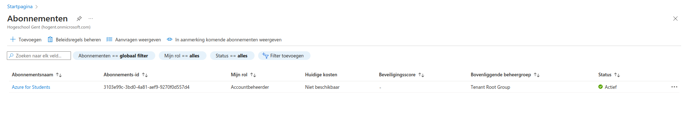

# Lab 3: The ML Workflow

## :mortar_board: Learning goals

- Create a simple ML workflow with Azure ML
- Deploy a model to an Azure managed endpoint

## :memo: Acceptance criteria

- Show that you created an Azure ML workspace
- Show that your ML workflow is working
- Show that you deployed a model to an Azure managed endpoint
- Show that you wrote an elaborate lab report in Markdown and pushed it to the repository
- Show that you updated the cheat sheet with the commands you need to remember

## 1. Prerequisites

Before you start this lab, you should check if you still have an Azure for Students subscription. Open the [Azure portal](https://portal.azure.com) and check if you have a subscription by navigating to the [Subscriptions](https://portal.azure.com/#view/Microsoft_Azure_Billing/SubscriptionsBlade) page. You should see at least an **Active** subscription named `Azure for Students`:

If you click on the subscription, you should see the details of the subscription:

If you do not have a subscription, you can create one via <https://azure.microsoft.com/en-us/free/students/>. If your subscription has expired, you can renew it via <https://azure.microsoft.com/en-us/free/students/> or by clicking on the notification banner on the subscription details page.

## 2.1 Open the notebook

This lab is written in a Jupyter notebook which you can find in the `ml-workflow` folder. Go to <https://colab.research.google.com/> and sign in with your Google account if needed. Choose to upload a notebook and upload the `azure-ml.ipynb` notebook from the `ml-workflow` folder.

## 2.2 Follow the instructions in the notebook

From now on, you can follow the instructions in the notebook. You can run the code in the notebook by clicking on the play button next to the code block.

**Important!** Make sure you understand all the code that is written for you in the notebook. So don't just run the code, but read it and try to understand it. If you don't understand it, search for information on the Internet. Also read through the code in the cells starting with `%%writefile`. They contain crucial information for understanding how the pipeline actually works.

## 2.3 Download the notebook

When you're finished with the lab, you can download the notebook by clicking on `File > Download > Download .ipynb` in the menu bar. Overwrite the original `azure-ml.ipynb` notebook in the `ml-workflow` folder with your downloaded notebook. The notebook should contain all cells' output. Commit and push the changes to your GitHub repository.

## 2.4 Possible extensions

The notebook contains some possible extensions at the very end. You can try to implement them if you have time left.
