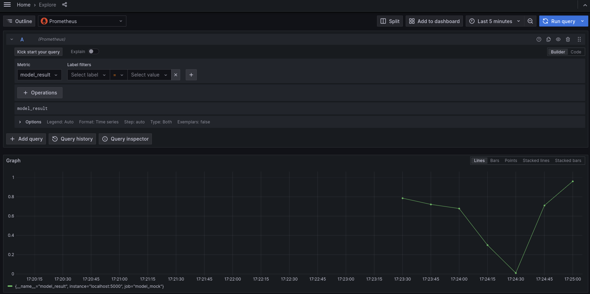
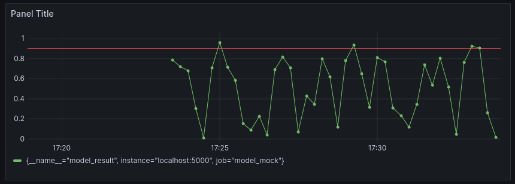

# Lab 6: Monitoring and logging

In this lab, you'll setup a monitoring solution based on [Prometheus](https://prometheus.io/) and [Grafana](https://grafana.com/). You'll create a mock model in Python that spits out test values in the interval [0, 1] every 5 seconds, set up Prometheus to gather the metric from the mocked model, visualize the metric from the model mock using Grafana, and use Alert manager to get notifications when the metric of the model reaches a certain threshold.

<span style="color:red; font-weight: bold">TODO</span>: network scheme

## :mortar_board: Learning Goals

<span style="color:red; font-weight: bold">TODO</span>

## :memo: Acceptance criteria

<span style="color:red; font-weight: bold">TODO</span>

## 6.1 Mocking the model

First, you have to set up the mocked model in [modelmock.py](../monitoring/modelmock.py) that starts a Prometheus metrics server. This metrics server will later on be be accessed by Prometheus to poll the metric.

To set up the mocked model, we'll use a [virtual environment](https://docs.python.org/3/library/venv.html). This is a **best practice** and it is always advised to install and run python projects this way, instead of installing directly on the host! The following [quote](https://peps.python.org/pep-0405/#motivation) lists the advantages of virtual environments in Python:

> The utility of Python virtual environments has already been well established by the popularity of existing third-party virtual-environment tools, primarily Ian Bicking’s virtualenv. Virtual environments are already widely used for dependency management and isolation, ease of installing and using Python packages without system-administrator access, and automated testing of Python software across multiple Python versions, among other uses.  
> ~ Carl Meyer

Follow the following steps to create a virtual environment and start the Prometheus metric server for the mocked model:

1. Create an environment: `python -m venv venv`. What is the meaning of the first `venv` argument, and what of the second? Which of the two can you change to your liking?
2. Activate the environment: `source venv/bin/activate`. Your terminal prompt will be changed to indicate that you are in a virtual environment.
3. Install the requirements using [requirements.txt](../monitoring/requirements.txt) : `pip install -r requirements.txt`.
4. Execute the mock: `python modelmock.py`

Now, surf to http://localhost:5000/ [^1] and refresh a few times. Where do you see the metric of the mocked model? What is the exact name of the metric?

Note: if you would like to stop the Prometheus metric server, follow the following steps below. Do this at the end of the lab, as you'll need the Prometheus metric server for the remainder of this lab.

1. Stop the python script using `Ctrl+C`.
2. Deactivate the environment: `deactivate`.

You'll see that your terminal prompt has changed back to normal.

## 6.2 Setting up Prometheus

To set up the Prometheus polling server and other services, we'll use `docker compose`. Create a `docker-compose.yml` file with a [Prometheus service](https://hub.docker.com/r/prom/prometheus). You can use the `prometheus.yml` config file below and map it to `/etc/prometheus/prometheus.yml` (remember the Docker lab). Make sure this is persistent (i.e. survives even if the contianer is removed and replaced). Chances are that this will give an error at first, but don't despair as the solution is probably easier than you think. Make sure that you [understand](https://prometheus.io/docs/prometheus/latest/configuration/configuration/) everything in the Prometheus config file.

```yaml
scrape_configs:
    - job_name: "model_mock"
        scrape_interval: 5s
        static_configs:
            - targets:
                - "localhost:5000"
```

Now, check if your Prometheus polling server can reach the mocked model's Prometheus metric server. Go to the Prometheus page at http://localhost:9090 [^1] and then to `Status` > `Service Discovery`. You should see the following:


This means that the Prometheus polling server will indeed try to poll the mocked model's Prometheus metric server. Now go to `Status` > `Targets` where you should see the following error:


That's not good! If you use the `ports` key in your `docker-compose.yml` then that port is forwarder so services on your host device (e.g. your laptop) can reach the Docker Compose services. However, **this does not work the other way around!** Docker Services cannot reach services on your host device: Docker Compose services are "stuck" in their own virtualized network where all services in a `docker-compose.yml` can reach each other, but not the outside world. This is very rarely needed and is often a **bad practice**: our case is somewhat special as this is an academic exercise, so we'll allow it here. Nevertheless, Docker Compose provides a setting that gives a service raw access to the host's network interface. This will make it look as if the service runs on your host instead of a Docker Compose virtual network. Can you find this [option](https://docs.docker.com/compose/compose-file/05-services/)?

If everything is configured correctly, you should see the following:


Now go to `Graph` and execute the following query: `model_result`. Can you see the metric of the mocked model? Refresh various times, when does it update?

If you select the `Graph` tab instead of the `Table` tab, you'll see the metric visually on a graph. Note that this graph doesn't update automatically, so you'll have to refresh periodically.


## 6.3 Grafana

You have probably noticed that the interface of Prometheus to query and see metrics is limited. Thankfully, we can use [Grafana](https://grafana.com/) to create beautiful dashboards on top of a Prometheus polling server. Add a [Grafana service](https://hub.docker.com/r/grafana/grafana-oss) to your `docker-compose.yml` and start the Docker Compose file. You should be able to access the Grafana website at https://localhost:3000 [^1]. Now let's configure the Grafana service:

1. Find out what the default username and password are. First thing to do once you are logged in, is to change the password to something better and private.

2. [Add](https://grafana.com/docs/grafana/latest/administration/data-source-management/?utm_source=grafana_gettingstarted) the Prometheus polling server as a data source.

3. Go to the `Home` > `Explore` section and query the `model_result` metric:

    

    You'll see that you have a lot more options, but you'll still have to manually refresh to update the graph. Adding this metric to a dash board will do this automatically for you.

4. Before you start to create a dashboard, you better make sure the Grafana configuration is set up in a consistent way. Which folders or volumes do you have to map in `docker-compose.yml` to make sure Grafana won't forget your configuration. Test it thoroughly!

5. Now create a dashboard which does the following:

    - We see the same graph as the query.
    - It refreshes every 5 seconds.
    - It shows the history of the past 15 minutes.
    - It shows a red threshold line at $y=0.9$.

        

## 6.4 Alertmanager

<span style="color:red; font-weight: bold">TODO</span>

## Possible extensions

-   Show that python packages installed in the virtual environment, are not installed on your host machine.
-   Add another [type](https://prometheus.io/docs/concepts/metric_types/) of metric to the script, and visualize it on the Grafana dashboard.

<span style="color:red; font-weight: bold">TODO</span>

[^1]: These are the default ports, but obviously depends on the settings you have configured.
