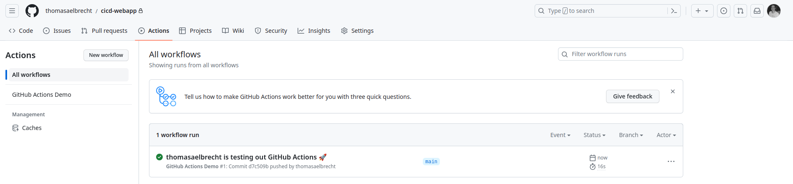
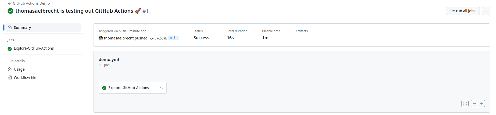
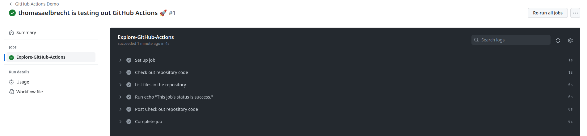

# Lab 2: Continuous Integration/Delivery with GitHub Actions

In this lab assignment, you will learn the basics on how to set up a build pipeline with GitHub Actions. We will re-use the sample application from the previous lab assignment. We'll lint the code, build the Docker image and push it to Docker Hub.

## :mortar_board: Learning Goals

- Creating simple actions and workflows
- Running a pipeline to lint the code, and build and push a Docker image

## :memo: Acceptance criteria

- Show that you created a GitHub repository for the sample application
- Show the overview of workflow runs in the GitHub Actions tab
- Show that the application image is available on Docker Hub
- Make a change to the sample application, commit and push, and show that the build pipeline is triggered automatically
- Enable dependabot and show that it creates a PR if a dependency is outdated.
- Show that you wrote an elaborate lab report in Markdown and pushed it to the repository
- Show that you updated the cheat sheet with the commands you need to remember

## 1.1 Create a GitHub repository for the sample application

You will need a GitHub repository with a sample application in order to experiment with GitHub actions.

Ensure that Git is configured correctly, e.g. with `git config --global --list` and check that `user.name` and `user.email` are set. If not, make the necessary changes:

```console
git config --global user.name "Bobby Tables"
git config --global user.email "bobby.tables@student.hogent.be"
```

Copy the starter code from the directory [dockerlab/webapp](../dockerlab/webapp/) to some new directory outside this Git repository. Enter the copied directory and initialize it as a Git repository with `git init`. Add all code using `git add .`. All code should be in the root of the repository, not in a subdirectory.

If your directory contains the `database` directory. Make sure it is not tracked by Git. You can check if it's being tracked using `git status`.

Now, commit all code:

```console
git commit -m "Initial commit of sample application"
```

On GitHub, create a new public repository and record the URL, probably something like `git@github.com:USER/cicd-webapp.git` (with USER your GitHub username).

Link your local repository with the one you created on GitHub (the GitHub page of your repository will show you the exact command needed for this):

```console
git remote add origin git@github.com:USER/cicd-sample-app.git
```

Then push the locally committed code to GitHub:

```console
git push -u origin main
```

Now you should see all sample code on GitHub.

## 1.2 Create a new GitHub Actions workflow

Create a file named `demo.yml` in a directory `.github/workflows/` in your repository. Add the following content:

```yaml
---
name: GitHub Actions Demo
run-name: ${{ github.actor }} is testing out GitHub Actions 🚀
on:
  push:
    branches:
      - main
jobs:
  Explore-GitHub-Actions:
    runs-on: ubuntu-latest
    steps:
      - name: Check out repository code
        uses: actions/checkout@v3
      - name: List files in the repository
        run: |
          ls ${{ github.workspace }}
      - run: echo "This job's status is ${{ job.status }}."
```

Commit and push this file to GitHub. You should see a new workflow appear in the Actions tab of your repository.



Click on the workflow to see the details. You should see something like this:



Click on the `Explore-GitHub-Actions` job to see the details of the job. You should see something like this:



Open every step to see the details of the step. Explore the output of each step. You should see the repository content in the output of the third step.

## 1.3 Lint the code

Remove the `demo.yml` file and create a new file named `build.yml` in the same directory. Add the following content:

```yaml
---
name: Build and test
on:
  push:
    branches:
      - main
jobs:
  build:
    runs-on: ubuntu-latest
```

This is not a complete workflow yet. Add a first step to check out the repository code. You can use the same step as in the previous workflow.

Commit and push the changes to GitHub, then check the result in the Actions tab.

Add a second step to install NodeJS on the build server. Search for a proper action in the [GitHub Marketplace](https://github.com/marketplace). Prefer actions from verified publishers. Use NodeJS version 20. It's okay to specify a hard coded NodeJS version, you don't need the `strategy` option.

Before we can lint the project, we need to install the dependencies. Use the the [run](https://docs.github.com/en/actions/using-workflows/workflow-syntax-for-github-actions#jobsjob_idstepsrun) action to execute `yarn install`.

Finally, add a step to run the command `yarn lint`.

Commit and push the changes to GitHub and check the result in the Actions tab.

Your workflow should fail because of linting errors, not any other error. Open the action details and fix every linting error. Do not change any ESLint configuration, only change code. Commit and push the changes to GitHub and check the result in the Actions tab.

Now your workflow should succeed.

## 1.4 Build the Docker image for the sample application

Add a new step to the workflow to build the Docker image. Search for a proper action in the [GitHub Marketplace](https://github.com/marketplace). Prefer actions from verified publishers. Make sure to configure the following things:

- Do not push the image to Docker Hub yet
- Use the `Dockerfile` in the root of the repository
- Tag the image with the exact same tag as the previous lab, e.g. `<your-docker-hub-username>/webapp:latest`

The workflow should succeed. Check the result in the Actions tab.

## 1.5 Push the Docker image to Docker Hub

The next step is to push the Docker image to Docker Hub. Add your username and password to the repository secrets using the documentation on <https://docs.github.com/en/actions/security-guides/encrypted-secrets>. Pick a suitable name for the secret, e.g. `DOCKERHUB_USERNAME` and `DOCKERHUB_PASSWORD`.

Add a new action before the build action to log in to Docker Hub. Search for a proper action in the [GitHub Marketplace](https://github.com/marketplace). Prefer actions from verified publishers.

If possible, extend the previous action to also push the image to Docker Hub. Normally you should only alter one configuration parameter. If not, search an action that can build and push the image to Docker Hub.

Commit and push the changes to GitHub and check the result in the Actions tab. You should also see the image appear in your Docker Hub repository.

## 1.6 Dependabot

After building a workflow, you might notice that it's recommended to specify the version numbers of GitHub Actions in the `.yml` files. To keep these versions up to date, you need to periodically check for new releases and update your workflow accordingly. This process can be error-prone and is often overlooked. Fortunately, this process can also be automated!

[Dependabot](https://docs.github.com/en/code-security/getting-started/dependabot-quickstart-guide) is a tool that automatically and periodically checks the dependencies of [various types of software](https://docs.github.com/en/code-security/dependabot/ecosystems-supported-by-dependabot/supported-ecosystems-and-repositories) (such as `npm`, `pip`, etc.) in a GitHub repository. When it finds an outdated dependency, it creates a pull request to update it. This ensures that your software and CI/CD pipelines remain up to date.

Follow the instructions in the [Dependabot documentation](https://docs.github.com/en/code-security/dependabot/working-with-dependabot/keeping-your-actions-up-to-date-with-dependabot) to configure Dependabot to monitor your GitHub Actions and perform weekly checks. After setting it up, intentionally downgrade a GitHub Action and commit the changes. Verify if Dependabot generates a pull request to update the downgraded action.

## Reflection

This lab assignment was much less complex than a real-life build pipeline would be, but you were able to see how GitHub Actions can be used to build, test _and_ deploy an application automatically.

What would change in a real-life case:

- The repository is likely to be private. This applies to both GitHub and Docker Hub. In that case you might need to configure some access tokens.
- You would also limit the access to the repository to only the people who need it, and configure the access rights for each person.
- The build pipeline would probably be much more elaborate, with linting, static code analysis, unit tests, functional, integration, acceptance and performance tests, packaging the application, publishing the package...
- Depending on the situation, it may be decided that the deployment phase is never done automatically, but manually after a successful build. This is the difference between _Continuous Integration_ (no automatic deployment) and _Continuous Delivery_.

And we haven't even discussed any necessary changes to a database schema when new code is deployed!

## Possible extensions

- Add a test step to the workflow. Do not alter any code, use the `yarn test` command and make sure the tests pass.
- Instead of using your password to sign in to Docker Hub, use a [personal access token](https://docs.docker.com/docker-hub/access-tokens/).
- Configure [Snyk](https://github.com/snyk/actions) to check for vulnerabilities in your dependencies. You will need to create an account on <https://snyk.io/> and add the API token as a secret to your repository.
- Try to create a build pipeline for an app of your choice. Maybe a personal project? Or a project from another course?
