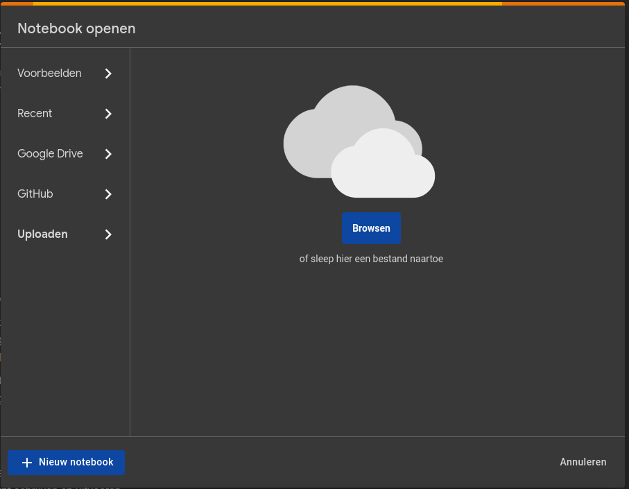

# Lab 2: The ML Workflow

## :mortar_board: Learning goals

- Create a simple ML workflow with Prefect
- Log metrics and artifacts with MLFlow
- Make a prediction with the registered model

## :memo: Acceptance criteria

- Show that you've executed the notebook and pushed it to the repository
  - Show that your Jupyter notebook contains all cells' output
- Show that you created a virtual environment for the project
- Show the Prefect and MLFlow dashboards
- Show that your ML pipeline is working
- Show the logs and metrics in the MLFlow dashboard
  - Show that you only have one run per pipeline execution
- Show that you registered a model in MLFlow
- Show that you are able to make a prediction with the registered model
- Show that you wrote an elaborate lab report in Markdown and pushed it to the repository
  - Provide an answer to all questions marked with :question:
  - Show that it contains the screenshots of the MLFlow dashboard

## 2.1. The scenario

The typical machine learning (ML) workflow begins within a Jupyter notebook where data scientists and analysts prototype and experiment with ML models. In the notebook, they perform essential tasks such as data preprocessing, exploratory data analysis (EDA), feature engineering, model selection, training, and evaluation. Once a promising model is developed and tested locally, the transition to MLOps (Machine Learning Operations) is crucial.

For this lab assignment, you get a Jupyter notebook which contains a very simple ML model to classify images of apples and oranges. It's your job to create an ML pipeline using [Prefect](https://www.prefect.io/).

There are many providers of tools for creating ML pipelines. This lab assignment deliberately uses Prefect, a Python-based workflow automation tool. Prefect is a modern workflow orchestration tool that is easy to use and has a lot of features. It is a good choice for creating ML pipelines and you should be able to translate the concepts you learn here to other tools like Kubeflow, Azure ML Pipelines, etc. Prefect is also a nice tool for testing ML pipelines locally, without the need for a cloud provider.

## 2.2. The notebook

Before diving into the ML pipeline, try to execute the notebook first. This will give you an idea of what the notebook does and how the ML model is trained.

### 2.2.1. Run the notebook

Open the notebook `resources/02-ml-workflow/ml_workflow.ipynb` in [Google Colab](https://colab.research.google.com/). Choose to upload a notebook and upload the `ml_workflow.ipynb` notebook from the `resources/02-ml-workflow` folder.



You can also run the notebook locally if you have the required dependencies installed.

### 2.2.2. Download the notebook

When you're finished with the lab, you can download the notebook by clicking on `File > Download > Download .ipynb` in the menu bar. Overwrite the original `ml_workflow.ipynb` notebook in the `resources/02-ml-workflow` folder with your downloaded notebook. The notebook should contain all cells' output. Commit and push the changes to your GitHub repository.

## 2.3. The ML pipeline

Now that you have a basic understanding of the ML model, it's time to create an ML pipeline.

### 2.3.1. Setup the environment

First, we need to install some dependencies. We're not installing the dependencies for the whole system, but only for this project. We can do this by creating a [virtual environment](https://docs.python.org/3/library/venv.html). Run the following commands in your terminal:

```bash
cd resources/02-ml-workflow
python -m venv venv
```

Now activate the virtual environment:

```bash
source venv/bin/activate    # Linux/macOS
venv\Scripts\Activate.ps1   # Windows (PowerShell)
```

Finally install the required dependencies:

```bash
pip install -r requirements.txt
```

:question: Where are the dependencies installed?

:warning: Make sure to activate the virtual environment in **every** terminal you use for this project. You can deactivate the virtual environment by running the `deactivate` command.

### 2.3.2. Start the Prefect server

Before we can develop the pipeline, we need to start the Prefect server. The Prefect server is a web application that provides a dashboard for monitoring and managing your workflows. Run the following command:

```bash
# Make sure to activate the virtual environment first!

export PREFECT_HOME=$(pwd)/prefect_home              # <- Linux/macOS
$Env:PREFECT_HOME = "$(Get-Location)/prefect_home"   # <- Windows (PowerShell)

prefect server start
```

Open the Prefect server in your browser by navigating to `http://localhost:4200`. You should see the Prefect dashboard.

:question: Why do we need to set the `PREFECT_HOME` environment variable?

### 2.3.3. Create the pipeline

Now it's time to create the pipeline. Create a new file `ml_workflow.py` in the `resources/02-ml-workflow` folder. Open the file in your favorite code editor. We'll define the pipeline using Prefect's Python API.

The pipeline should contain the following steps:

1. **Download data:** Download all images from our GitHub repository.
   - Input: nothing
   - Output: nothing
2. **Preprocess data:** Preprocess the images and split them into training, validation and test sets.
   - Input: nothing
   - Output: training, validation and test dataset generators
3. **Train the model:** Train the model on the training set.
   - Input: training & validation dataset generator
   - Output: model file name
4. **Evaluate the model:** Evaluate the model on the test set.
   - Input: model file name + test dataset generator
   - Output: nothing

Each of these steps should be a separate `task` in the pipeline. The tasks should be connected in the correct order using a `flow`.

Write your pipeline file named `ml_workflow.py` in the folder `resources/02-ml-workflow`. Use the following documentation to help you create the pipeline:

- [Write and run tasks](https://docs.prefect.io/3.0/develop/write-tasks)
- [Write and run flows](https://docs.prefect.io/3.0/develop/write-flows)

Create the pipeline in little steps. Do **not** create the entire pipeline at once without running it. This will make debugging much harder. Instead, create the first task, run it, then create the second task, run it, etc.

Make sure to set constants at the top of your script! This way, you can easily change the values of these constants without having to search through your entire script.

## 2.4. MLFlow

Now we're going to integrate [MLFlow](https://mlflow.org/) in our pipeline. MLFlow is an open-source platform for managing the end-to-end machine learning lifecycle. It's a great tool for tracking experiments, packaging code into reproducible runs, and sharing and deploying models.

MLFlow was already installed when you installed the dependencies. You can start the MLFlow server by running the following command in a separate terminal:

```bash
# Make sure to activate the virtual environment first!
mlflow server
```

Open the MLFlow server in your browser by navigating to `http://localhost:5000`. You should see the MLFlow dashboard.

Go to your Prefect flow and set the MLFlow tracking URI and the experiment name. Use global variables on top of your script to store these values. Configure these setting in your `main` function.

MLFlow is also able to log [system metrics](https://mlflow.org/docs/latest/system-metrics/index.html). `psutil` was already installed when you installed the dependencies. Configure MLFlow to log system metrics by using the [`enable_system_metrics_logging` function](https://mlflow.org/docs/latest/system-metrics/index.html#using-mlflow-enable-system-metrics-logging).

Enable auto logging for the entire pipeline by using the [`mlflow.autolog()` function](https://mlflow.org/docs/latest/python_api/mlflow.html#mlflow.autolog) in your `main` function. This will automatically log metrics and artifacts for your pipeline.

Run your pipeline and check if the logs and metrics are visible in the MLFlow dashboard. You should only see one run in the dashboard. If you see multiple runs, alter your pipeline so that only one run is created.

At last register your model in MLFlow by using the [`mlflow.register_model` function](https://mlflow.org/docs/latest/model-registry.html#adding-an-mlflow-model-to-the-model-registry). It should be visible in the MLFlow dashboard under the menu item `Models`. Give it a proper name.

Add some screenshots of the graphs, metrics, artifacts and the registered model to your lab report.

## 2.5. Performing a prediction

Now that you have a registered model in MLFlow, you can make a prediction with it. Create a new Python script `predict.py` in the `resources/02-ml-workflow` folder. In this script, you should load the registered model from MLFlow and make a prediction with it. Pick two random image (one apple and one orange) from the internet and use it as input for your prediction.

:question: Why do you need to use the registered model from MLFlow and not the model file directly?

:question: What's the purpose of the MLFlow Model Registry?

## Possible extensions

- Can you make the basic model above better? Note that better doesn't just mean scoring higher on this dataset. It means that the model is more robust and can generalize better to unseen data. You could try one or more of the following:
  - Create a better dataset
  - Add more layers
  - Use transfer learning
  - Use hyperparameter turning
  - Data augmentation
  - ...
- Can you modify the components/pipeline so that you can choose the amount of epochs the model trains for?
- ...
