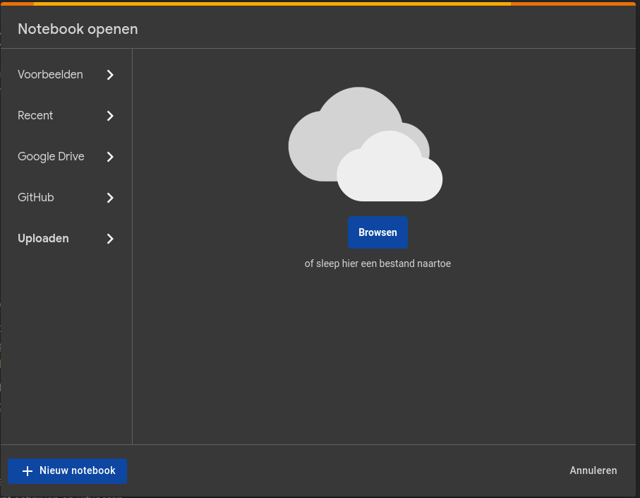

# Lab 3: Quantization and pruning

The goal of this assignment is to get familiar with the TensorFlow Lite framework, a framework for running machine learning models on edge devices. You will learn how to convert a TensorFlow model to a TensorFlow Lite model and how to use the TensorFlow Lite interpreter to run inference on the model. You will also learn how to use the TensorFlow Lite converter to quantize and prune a model.

## :mortar_board: Learning goals

- Get familiar with the TensorFlow Lite framework
- Convert a TensorFlow model to a TensorFlow Lite model with quantization
- Train a quantization aware model
- Perform weight pruning on a model

## :memo: Acceptance criteria

- Show that you've executed the notebook and pushed it to the repository
- Show that you can convert a TensorFlow model to a TensorFlow Lite model
- Show that you can execute post-training quantization on a model
- Show that you can train a quantization aware model
- Show that you can perform weight pruning on a model
- Show that you wrote an elaborate lab report in Markdown and pushed it to the repository
  - Provide an answer to all questions marked with :question:, use code to support your answers where applicable
  - Discuss the answers during the demo session

## 3.1. Open the notebook

This lab is written in a Jupyter notebook named `quantization_and_pruning.ipynb`, which you can find in the `resources/ssw` folder. Go to <https://colab.research.google.com/> and sign in with your Google account if needed. Choose to upload a notebook and upload the `quantization_and_pruning.ipynb` notebook from the `ml-workflow` folder.

## 3.2. Follow the instructions in the notebook

From now on, you can follow the instructions in the notebook. You can run the code in the notebook by clicking on the play button next to the code block. Some cells contain a `# TODO:` comment. You should fill in the missing information before running the code cell.

**Important!** Make sure you understand all the code that is written for you in the notebook. So don't just run the code, but read it and try to understand it. If you don't understand it, search for information on the Internet.

:question: While working on the notebook, answer the following questions **in your own words**:

- What is the role of `model_builder()`: how does it differ from building a model manually?
- What is the purpose of the TensorFlow Lite format? How does it differ from the TensorFlow format?
- What changes in the model's layers after making it quantization aware?
- What is quantization and pruning?
- Why should you use quantization aware training instead of simply quantizing a model after training?
- When do you see a difference in the model's size when using quantization: after conversion to TFLite of after model compression using gzip? Why is that?
- And when in the case of pruning: after conversion or after compression? Why is that?
- What is the role of the `sparsity` and `step` parameters in the `PolynomialDecay` function?
- Why do we need to remove the pruning layer before saving the model?

## Possible extensions

- Improve the model (e.g. using <https://colab.research.google.com/drive/1W8fCTLZAO9YKcNRQzYfFf__9CROQLOcZ>) and compare the model sizes after improvement.
- Use 16 bit floating point numbers for quantization instead of the default 8 bit integers.
- Create a quantized and/or pruned model for a model of your choice or a personal project.
