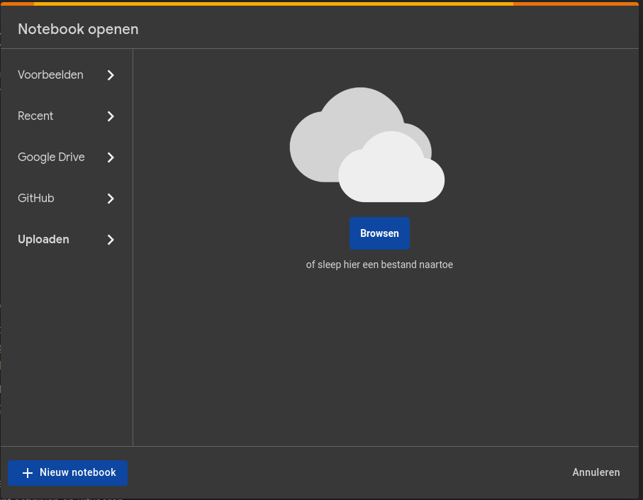

# Lab 5: Quantization and pruning

The goal of this assignment is to get familiar with the TensorFlow Lite framework, a framework for running machine learning models on edge devices. You will learn how to convert a TensorFlow model to a TensorFlow Lite model and how to use the TensorFlow Lite interpreter to run inference on the model. You will also learn how to use the TensorFlow Lite converter to quantize and prune a model.

## :mortar_board: Learning goals

- Get familiar with the TensorFlow Lite framework
- Convert a TensorFlow model to a TensorFlow Lite model with quantization
- Train a quantize aware model
- Perform weight pruning on a model

## :memo: Acceptance criteria

- Show that you've executed the notebook and pushed it to the repository
- Show that you can convert a TensorFlow model to a TensorFlow Lite model with quantization
- Show that you can train a quantize aware model
- Show that you can perform weight pruning on a model
- Show that you wrote an elaborate lab report in Markdown and pushed it to the repository
- Provide an answer for all the questions asked

## 1. Open the notebook

This lab is written in a Jupyter notebook named `quantization-and-pruning.ipynb`, which you can find in the `resources/05-quantization-and-pruning` folder. Go to <https://colab.research.google.com/> and sign in with your Google account if needed. Choose to upload a notebook and upload the `quantization-and-pruning.ipynb` notebook from the `ml-workflow` folder.

## 2. Follow the instructions in the notebook

From now on, you can follow the instructions in the notebook. You can run the code in the notebook by clicking on the play button next to the code block. Some cells contain a `# TODO:` comment. You should fill in the missing information before running the code cell.

**Important!** Make sure you understand all the code that is written for you in the notebook. So don't just run the code, but read it and try to understand it. If you don't understand it, search for information on the Internet.

While working on the notebook, answer the following questions **in your own words**:

- What is the role of `model_builder()`: how does it differ from building a model manually?
- What is the purpose of the TensorFlow Lite format? How does it differ from the TensorFlow format?
- What changes in the model's layers after making it quantization aware?
- What is quantization and pruning?
- What is the difference between post-training quantization and quantization aware training?
- When do you see a difference in the model's size when using quantization: after training of after model compression? Why is that?
- And when in the case of pruning: after training or after model compression? Why is that?
- What is the role of the `sparsity` and `step` parameters in the `PolynomialDecay` function?
- Why do we need to remove the pruning layer before saving the model?

## Possible extensions

The notebook contains some possible extensions at the very end. You can try to implement them to get a more profound understanding of TensorFlow Lite.
