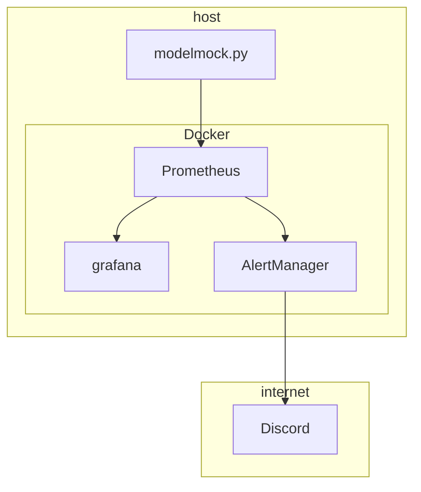
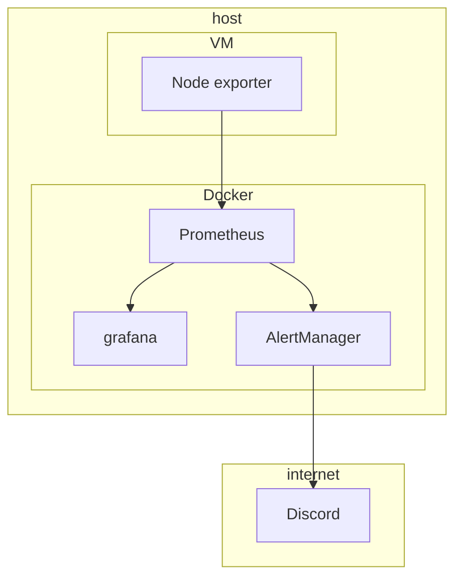
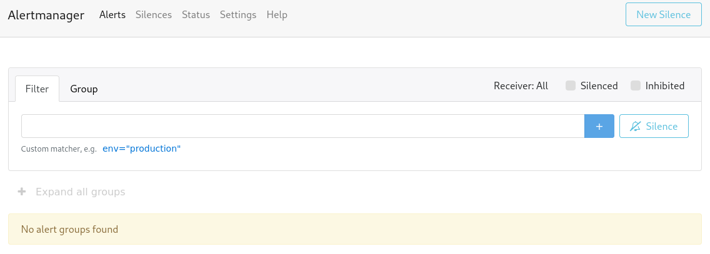
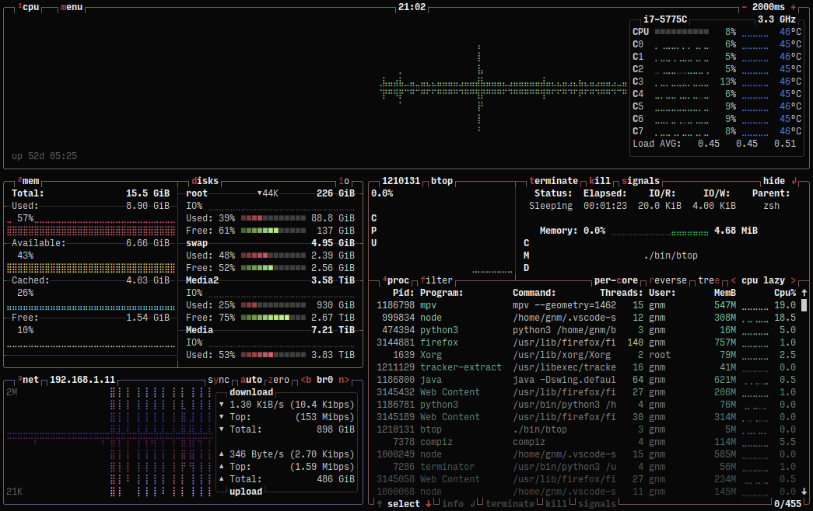
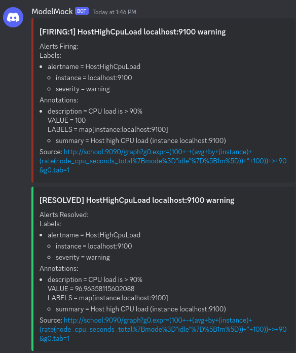

# Lab 7: Monitoring and alerting

In this lab, you'll setup a monitoring solution based on [Prometheus](https://prometheus.io/) and [Grafana](https://grafana.com/).

First, you'll create a mock model in Python that spits out test values in the interval [0, 1] every 5 seconds, set up Prometheus to gather the metric from the mocked model, visualize the metric from the model mock using Grafana, and use Alert manager to get notifications on Discord when the metric of the model reaches a certain threshold.



Next, we'll create a VM and start monitoring various metrics of that VM such as CPU usage thanks to Node Exporter. If the VM shows abnormal activity, we'll again receive notifications on Discord.



## :mortar_board: Learning Goals

- Understanding the concept of monitoring
- Understanding the concept of alerting
- Understanding how Prometheus, Grafana, AlertManager, a receiver, and Node Exporter work together
- Being able to set up monitoring using Prometheus
  - Monitoring of an application or the result of an ML pipeline
  - Monitoring of a VM or host
- Being able to set up visualization dashboards using Grafana
- Being able to set up alerting using Alert Manager and a receiver such as Discord

## :memo: Acceptance criteria

- Show that your mocked model is running in a Python virtual environment and that you can access it's metrics by HTTP
- Show that Prometheus receives the mocked model's metric
- Show that Grafana receives the mocked model's metric
  - The dashboard should refresh every 5 s
  - The dashboard shows the history of the past 15 min
  - The graph shows a red threshold line at $y = 0.75$
- Show that you receive alerts about the mocked model metric through Discord
- Show that Node Exporter is running on the VM and that you can access its metric's by HTTP
- Show that you can see the CPU going to 100% by using `stress-ng` with `htop`/`btop` on the CLI of the VM.
- Show that you don't receive an alert if the CPU is high for 2 min, but do receive an alert if the CPU is high for 4 min
  - Also show that you can check these CPU values in Grafana
  - Also show that you receive a resolve alert when the CPU load drops after the 4 min of high load
- Show that you wrote an elaborate lab report in Markdown and pushed it to the repository
  - Also show that the report contains all answers to the questions in the lab
- Show that you updated the cheat sheet with the commands you need to remember

## 7.1 Mocking the model

First, you have to set up the mocked model in [modelmock.py](../monitoring/modelmock.py) that starts a Prometheus metrics server. This metrics server will later on be be accessed by Prometheus to poll the metric.

To set up the mocked model, we'll use a [virtual environment](https://docs.python.org/3/library/venv.html). Follow the steps below to create a virtual environment and start the Prometheus metric server for the mocked model.

1. Go to the `monitoring` folder in the root of your repository.
2. Create a virtual environment and activate it.
   - Make sure the virtual environment files are not tracked by git!
3. Install the requirements using [requirements.txt](../monitoring/requirements.txt).
4. Execute the mock: `python modelmock.py`

Now, surf to <http://localhost:9000/> [^1] and refresh a few times. Where do you see the metric of the mocked model? What is the exact name of the metric?

Note: if you would like to stop the Prometheus metric server, follow the following steps below. Do this at the end of the lab, as you'll need the Prometheus metric server for the remainder of this lab.

1. Stop the python script using `Ctrl+C`.
2. Deactivate the environment: `deactivate`.

You'll see that your terminal prompt has changed back to normal.

## 7.2 Setting up Prometheus

To set up the Prometheus polling server and other services, we'll use `docker compose`. Create a `docker-compose.yml` file with a [Prometheus service](https://hub.docker.com/r/prom/prometheus). You can use the `prometheus.yml` config file below and map it to `/etc/prometheus/prometheus.yml` (remember the Docker lab). Make sure this is persistent (i.e. survives even if the container is removed and replaced). Chances are that this will give an error at first, but don't despair as the solution is probably easier than you think. Make sure that you [understand](https://prometheus.io/docs/prometheus/latest/configuration/configuration/) everything in the Prometheus config file.

```yml
global:
  scrape_interval: 5s

scrape_configs:
  - job_name: model_mock
    static_configs:
      - targets:
          - localhost:9000
```

Now, check if your Prometheus polling server can reach the mocked model's Prometheus metric server. Go to the Prometheus page at <http://localhost:9090> [^1] and then to `Status` > `Service Discovery`. You should see the following:


This means that the Prometheus polling server will indeed try to poll the mocked model's Prometheus metric server. Now go to `Status` > `Targets` where you should see the following error:


That's not good! If you use the `ports` key in your `docker-compose.yml` then that port is forwarder so services on your host device (e.g. your laptop) can reach the Docker Compose services. However, **this does not work the other way around!** Docker Services cannot reach services on your host device: Docker Compose services are "stuck" in their own virtualized network where all services in a `docker-compose.yml` can reach each other, but not the outside world. This is very rarely needed and is often a **bad practice**: our case is somewhat special as this is an academic exercise, so we'll allow it here. Nevertheless, Docker Compose provides a setting that gives a service raw access to the host's network interface. This will make it look as if the service runs on your host instead of a Docker Compose virtual network. Can you find this [option](https://docs.docker.com/compose/compose-file/05-services/)?

If everything is configured correctly, you should see the following:


Now go to `Graph` and execute the following query: `model_result`. Can you see the metric of the mocked model? Refresh various times, when does it update?

If you select the `Graph` tab instead of the `Table` tab, you'll see the metric visually on a graph. Note that this graph doesn't update automatically, so you'll have to refresh periodically.


## 7.3 Grafana

You have probably noticed that the interface of Prometheus to query and see metrics is limited. Thankfully, we can use [Grafana](https://grafana.com/) to create beautiful dashboards on top of a Prometheus polling server. Add a [Grafana service](https://hub.docker.com/r/grafana/grafana-oss) to your `docker-compose.yml` and start the Docker Compose file. You should be able to access the Grafana website at <http://localhost:3000> [^1]. Now let's configure the Grafana service:

1. Find out what the default username and password are. First thing to do once you are logged in, is to change the password to something better and private.

   - Make sure to save the password in e.g. a password manager!

2. [Add](https://grafana.com/docs/grafana/latest/administration/data-source-management/?utm_source=grafana_gettingstarted) the Prometheus polling server as a data source.

3. Go to the `Home` > `Explore` section and query the `model_result` metric. You'll see that you have a lot more options, but you'll still have to manually refresh to update the graph. Adding this metric to a dashboard will do this automatically for you.

   

4. Before you start to create a dashboard, you better make sure the Grafana configuration is set up in a persistent way. Which folders or volumes do you have to map in `docker-compose.yml` to make sure Grafana won't forget your configuration. Test it thoroughly!

   - Also make sure the Grafana data is not tracked by git. Alter your `.gitignore` file if necessary.

5. Now create a dashboard which does the following:

   - We see the same graph as the query.
   - It refreshes every 5 seconds.
   - It shows the history of the past 15 minutes.
   - It shows a red threshold line at $y=0.75$.


## 7.4 Alertmanager

### 7.4.1 Generating alerts

We would like to receive notifications when the mocked model's metric goes above 0.75. Luckily, Prometheus allows use to define [alerting rules](https://prometheus.io/docs/prometheus/latest/configuration/alerting_rules/) which can do that (and much more). Create the following file `rules.yml`:

```yml
groups:
  - name: example
    rules:
      - alert: ModelMockHighAccuracy
        expr: model_result > 0.75
        annotations:
          summary: "Model mock accuracy is very high"
          description: "Model mock accuracy is very high at {{ $value }}"
```

Now make sure it is mapped by a volume to your Prometheus service. You also have to update the Prometheus [configuration file](https://prometheus.io/docs/prometheus/latest/configuration/configuration/) so Prometheus knows where to find the rules, and set the `evaluation_interval` to 5s, so every scrape can trigger an alert.

If all went well, you should see the following under `Alerts` in the Prometheus polling service:


As long as the metric stays equal or lower than 0.75, it will remain active. As soon as the metric gets a value higher than 0.75, the alert will be triggered or "fired":


You can also see the annotations as they were defined in the rules configuration file:


The alert only stays triggered as long as the metric stays above 0.75. This means that after 5s it will probably be reset to inactive as the chance is high the next value is equal or lower than 0.75. You can see this for yourself: open the Grafana dashboard and the Prometheus alerts page side by side. Track the metric in real time on the Grafana Dashboard. As soon as the metric gets a value above 0.75, reload the Prometheus alert page to see if it triggered.
_Tip: change 0.75 to something that occurs more often for testing so you don't have to wait so long till the alert is triggered._

Although Prometheus is responsible for triggering alerts based on metrics, it only has basic functionality. Just like we can use Grafana for better visualizations, we can use [AlertManager](https://prometheus.io/docs/alerting/latest/alertmanager/) for better alert handling. It's benefits are:

- You can hook up various type of receivers: mail, Matrix, Slack, Teams, Discord...
- It supports grouping, inhibition, and silencing. What do these terms mean? How do they differ from each other? Make sure you understand all of this!

Add an [AlertManager service](https://hub.docker.com/r/prom/alertmanager) to your `docker-compose.yml`. Now you'll also have to update your Prometheus polling server's config so Prometheus knows to where it must send the alerts:

```yml
alerting:
  alertmanagers:
    - static_configs:
        - targets:
            - localhost:9093
```

If all goes well, you'll be able to to the AlertManager page at <http://localhost:9093> and see the following page:



As long as there haven't been any results, the page will be empty. Keep a watch on your Grafana dashboard so you can see when an alert should be triggered. At that moment, refresh the page and you'll see the alert:


You can press on `Info` to see the annotations.

### 7.4.5 Adding a receiver

There are various channels possible on which you can receive notifications. As students don't have permissions to create a Microsoft Team and you probably use Discord to talk to other students, we'll set up a [Discord](https://discord.com/) receiver, so you get notified if the mocked model's metric reaches a value above 0.75. Discord isn't the most professional tool for this, but it is free and is supported by default in AlertManager. Note that except for the receivers listed in the [documentation](https://prometheus.io/docs/alerting/latest/configuration/), there are also a lot of third party receivers available not listed in the documentation.

1. Create a Discord account if you haven't already got one.
2. [Create an new server](https://support.discord.com/hc/en-us/articles/204849977-How-do-I-create-a-server-). Make sure it has a [text channel](https://support.discord.com/hc/en-us/articles/4412085582359-Text-Channels-Text-Chat-In-Voice-Channels). Normally a new default server has a `# general` text channel, so you can use that or create another.
3. Read [Discord's "Intro to Webhooks" article](https://support.discord.com/hc/en-us/articles/228383668-Intro-to-Webhooks) . You can find more information about webhooks on the links below. Make sure you understand how a webhook works and how it differs from a traditional API!

   - <https://www.techtarget.com/searchapparchitecture/tip/Webhooks-explained-simply-and-how-they-differ-from-an-API>
   - <https://www.make.com/en/blog/what-are-webhooks>
   - <https://sendgrid.com/en-us/blog/whats-webhook>

   

4. Create the Discord webhook.
5. Create a configuration file for AlertManager called `alertmanager.yml`. Now make sure it is mapped by a volume to your AlertManager service (tip: look at the [contents](https://hub.docker.com/layers/prom/alertmanager/latest/images/sha256-b97390a5b2b52cf4dd66098a091ac0575d18fbf35acf2501fb0f180e3488ad15) of their Dockerfile on DockerHub to learn the correct path to where you should map). [Configure](https://prometheus.io/docs/alerting/latest/configuration/) it so that it takes your Discord webhook as a receiver. Start from the following template:

   ```yml
   route:
     group_by: ["..."]
     group_wait: 0s
     group_interval: 1s
     repeat_interval: 1h
     receiver: discord

   receivers:
     - name: discord
       discord_configs:
         - # <TODO> ...
           send_resolved: false
   ```

If all goes well, you should start seeing Discord notifications whenever the mocked model's metric goes above 0.75:


## 7.5 A more realistic use case

Monitoring is often used to not just monitor the accuracy of models, but for various metrics, such as server CPU/RAM load, storage shortages... . We'll use a virtual machine here to see how this can be done with Prometheus, Grafana and AlertManager. If we want to monitor the hardware metrics from a Linux machine, we can use [Node Exporter](https://prometheus.io/docs/guides/node-exporter/). This sets up a Prometheus metrics server for all available hardware metrics on the machine. You don't need the `modelmock.py` script anymore, so you can shut it off from here.

## 7.5.1 Set up monitoring and visualization

1. Create an [AlmaLinux](https://almalinux.org/) virtual machine however you want (manual, [osboxes.org](https://www.osboxes.org/), [Vagrant](https://www.vagrantup.com/)...). Just make sure it has the latest AlmaLinux version, and it is accessible from your host machine.
2. Install Node Exporter on the VM. _Tip: there is already a node exporter package in the repositories from AlmaLinux, but you'll have to do an extra step to be able to install it. Don't install Docker in the VM, getting the already existing package is a lot easier! Also, have you ever heard of `dnf search`? It is a very handy command!_
3. Don't forget to make sure Node Exporter is running. _Tip: if you have installed the already existing package, you just need to do `sudo systemctl enable --now prometheus-node-exporter`._
4. Check if Node Exporter is accessible inside the VM:

   ```console
   $ curl localhost:9100/metrics
   # HELP go_gc_duration_seconds A summary of the pause duration of garbage collection cycles.
   # TYPE go_gc_duration_seconds summary
   go_gc_duration_seconds{quantile="0"} 0
   go_gc_duration_seconds{quantile="0.25"} 0
   go_gc_duration_seconds{quantile="0.5"} 0
   go_gc_duration_seconds{quantile="0.75"} 0
   go_gc_duration_seconds{quantile="1"} 0
   go_gc_duration_seconds_sum 0
   go_gc_duration_seconds_count 0
   # HELP go_goroutines Number of goroutines that currently exist.
   # TYPE go_goroutines gauge
   go_goroutines 7
   # HELP go_info Information about the Go environment.
   # TYPE go_info gauge
   go_info{version="go1.17.5"} 1
   # HELP go_memstats_alloc_bytes Number of bytes allocated and still in use.
   # TYPE go_memstats_alloc_bytes gauge
   go_memstats_alloc_bytes 1.43752e+06
   # HELP go_memstats_alloc_bytes_total Total number of bytes allocated, even if freed.
   # TYPE go_memstats_alloc_bytes_total counter
   ```

5. Check if Node Exporter is accessible by your host machine. If not, use your Linux and networking skills to troubleshoot.
6. Edit `prometheus.yml` so that the Prometheus polling server knows where to find these metrics. Test that this works!

   

7. We could start building our own dashboard for all these metrics, but thankfully other people have build these already. Grafana allows us to share and use dashboard to and from other people. Import the [Node Exporter Full dashboard](https://grafana.com/grafana/dashboards/1860-node-exporter-full/). If all goes well you should start to see the visualizations for the VM:

   

8. Let's see if this actually works. We are going to use `stress-ng` on the VM to initialize a stress test. Install `stress-ng` through `dnf`:

   ```console
   $ stress-ng --cpu 1 --timeout 5m
   stress-ng: info:  [3423] setting to a 60 second run per stressor
   stress-ng: info:  [3423] dispatching hogs: 1 cpu
   ```

   You've learned about `top` in the Linux courses to see the resources used on the VM. `top` is good in a pinch, but not very "pretty". Let's install [`htop`](https://htop.dev/), a more visual and commonly used alternative, with `dnf`.

   

   If you want more visuals on the terminal, you can also use [`btop`](https://github.com/aristocratos/btop).

   

   Change the value of the `--cpu` option to the amount of CPU cores you have assigned to the VM. When `stress-ng` starts you should see the following:

   - On the VM, you can see the CPU is at 100% using `htop` / `btop`.
   - The CPU load on the graph in the Grafana dashboard goes to 100%.

   

   :bulb: Some students report they get the following `SIGILL` error whilst running `stress-ng`: `stressor terminated with unexpected signal signal 4 'SIGILL'`. The students solved this by using [different stressors](https://wiki.ubuntu.com/Kernel/Reference/stress-ng). As usual, the `man` page contains all the information about any stressors.

9. If you stop `stress-ng` (with Ctrl+C or wait for the timeout), you'll also see this reflected on the dashboard.

### 7.5.2 Set up alerting

Alerting is very handy for cases like this! You can be alerted if the CPU is high for some time, if the storage is getting full, if a machine is out of RAM and starts swapping... . Let's take the first case: let's monitor the CPU and send out an alert if has a high usage (> 90%) for 3 minutes. Add a rule to `rules.yml`, you'll probably need the [`for`](https://prometheus.io/docs/prometheus/latest/configuration/alerting_rules/#defining-alerting-rules) here. What does this do? You can find some inspiration on this [blogpost](https://www.robustperception.io/understanding-machine-cpu-usage/) and on [Awesome Prometheus alerts](https://samber.github.io/awesome-prometheus-alerts/) for creating the rule. Make sure you can explain the rule syntax!

Additionally, often we want also to be alerted if a situation has been restored to a good situation. This is called resolving. When we used the mocked model's metric, we explicitly disabled this with `send_resolved: false` in `alertmanager.yml` as it was unnecessary then. Remove this so resolve alerts will be send to Discord (resolving is actually the default behaviour).

Eventually, you should be able to demonstrate the following workflow:

1. Start the stress test in the VM.
2. Wait for 2 min and stop the stress test (_tip: use the `--timeout` option in `stress-ng`_). There should be no warning in Discord.
3. Again, start the stress test in the VM.
4. Wait for 5 min and stop the stress test. You should see an alert in Discord when the CPU was high for about 3 min. You should see a resolve alert in Discord when the CPU load goes low again that tells you that the alert is no longer valid and the metric once again behaves as expected.

#### An example:

```console
$ stress-ng --cpu 1 --timeout 2m && echo "Sleeping ..." && sleep 180 && stress-ng --cpu 1 --timeout 5m && echo "Sleeping ..." && sleep 60 && echo "Done..."
stress-ng: info:  [2221] setting to a 120 second (2 mins, 0.00 secs) run per stressor
stress-ng: info:  [2221] dispatching hogs: 1 cpu
stress-ng: info:  [2221] successful run completed in 120.01s (2 mins, 0.01 secs)
Sleeping ...
stress-ng: info:  [2227] setting to a 300 second (5 mins, 0.00 secs) run per stressor
stress-ng: info:  [2227] dispatching hogs: 1 cpu
stress-ng: info:  [2227] successful run completed in 300.00s (5 mins, 0.00 secs)
Sleeping ...
Done...
```

Grafana:


Discord:



Timeline of events:

- 13u37m40: start first stress test.
- 13u39m40: end first stress test.
- 13u42m40: start second stress test.
- 13u46m31: Alert on Discord.
- 13u47m40: end first stress test.
- 13u47m46: Resolve alert on Discord.

### 7.5.3 Alerting fatigue

In a real life situation, most time will probably be spend tuning the parameters of the monitoring configuration and alert rules. It is hard, but essential to make sure you do not have too much false positives, but als not too much false negatives. False positives give a lot of alerts: this will lead to "alert fatigue" where you think most of the alerts will not be imported or true, as most of them are false positives anyway. False negatives means that you don't know about most things going wrong as you don't get alerts for those problems. You should already know these terms (_false/true positive/negative_) from other machine learning courses. The balance between these terms is specific to each use case and situation, and it takes a lot of tuning to get it to an acceptable level.


> Image from <https://plat.ai/blog/confusion-matrix-in-machine-learning/>


> Image from <https://blog.gitguardian.com/should-we-target-zero-false-positives/>

## Possible extensions

- Show that python packages installed in the virtual environment, are not installed on your host machine.
- Add another [type](https://prometheus.io/docs/concepts/metric_types/) of metric to the script, and visualize it on the Grafana dashboard.
- Install Docker on the VM and start up some containers. Show that you can monitor these using [cAdvisor](https://prometheus.io/docs/guides/cadvisor/) .
- Explain the difference between `group_wait`, `group_interval` and `repeat_interval` in the `alertmanager.yml` configuration file.
- Set up another type of receiver (e.g. The [Matrix.org protocol](https://element.io/) can be a good and free choice). Can you use it at the same time as the Discord receiver?

[^1]: These are the default ports, but obviously depends on the settings you have configured.
