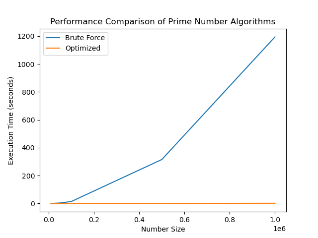
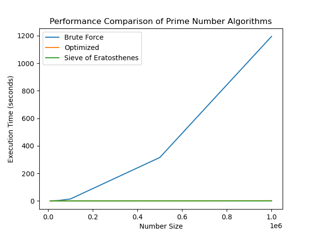
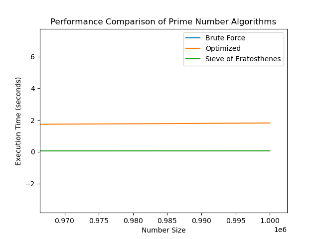

# Lab Report: Prime Numbers in Python

## Student information

- Student name: John Doe
- Student code: 123456

## Assignment description

The goal of this assignment is to write progressively more efficient Python scripts to calculate prime numbers in a given range. We start with a brute-force method and improve the algorithm by using more advanced methods, including an optimized square root approach and the Sieve of Eratosthenes. We will measure the performance of each method using time measurements, and visualize the performance differences using graphs.

## Proof of work done

### 1.2 Brute-force Prime Number Calculation

I have added the brute force code to [find_primes.py](../resources/00-dummy/find_primes.py).

```console
$ python find_primes.py
limit: 10000
primes found: 1229
brute force: 0.16472469300060766

limit: 100000
primes found: 9592
brute force: 14.25993315100277
```

The execution time for finding primes between 0 and 10_000 was **0.16 seconds**. For 100_000, the execution took **significantly longer (around 14.26 seconds)**. This illustrates the inefficiency of the brute-force method as `n` increases, especially as it checks each number in the range up to `n-1`.

### 1.3 Reducing Redundant Calculations

- Why use `int(math.sqrt(n)) + 1`?

    By looping up to the square root of `n`, we can eliminate unnecessary checks. If `n` has a factor larger than `sqrt(n)`, then it must also have a smaller factor, so we don't need to check numbers beyond the square root. The `+1` ensures we include the integer value of the square root in the loop.

I have also added the optimized code to [find_primes.py](../resources/00-dummy/find_primes.py).

```console
$ python find_primes.py
limit: 10000
primes found: 1229
optimized: 0.0035752210023929365

limit: 100000
primes found: 9592
optimized: 0.06148490199848311
```

The execution time was **0.0035 seconds** for [0, 10_000], which is much faster than brute-force. For 100_000, the optimized version took about **0.061 seconds**, which is a substantial improvement compared to the brute-force method.

### 1.4 Sieve of Eratosthenes

Explanation: The Sieve of Eratosthenes works by iteratively marking multiples of each prime number starting from 2. By the time we reach the end of the list, all the non-prime numbers have been marked, and only the prime numbers remain unmarked.

The time complexity of the Sieve of Eratosthenes is $O(n \log \log n)$. The space complexity of the sieve is $O(n)$, since you need to store the boolean list that represents primality for numbers up to n.

I have also added the sieve of Eratosthenes code to [find_primes.py](../resources/00-dummy/find_primes.py).

```console
$ python find_primes.py
limit: 10000
primes found: 1229
sieve: 0.00048590699952910654

limit: 100000
primes found: 9592
sieve: 0.00565514899790287
```

The execution time was **0.00049 seconds** for [0, 10_000]. For 100_000, the sieve took only **0.0057 seconds**, making it significantly faster than both the brute-force and optimized approaches.

### 1.5 Performance Comparison

To visualize the performance of the different algorithms, I plotted the execution time for different ranges of numbers.

[find_primes.py](../resources/00-dummy/find_primes.py) has been expanded to also display the requested plots using `matplotlib`.

- Brute-force vs. optimized approach:

    

- Brute-force vs. optimized vs sieve approach:

    

    Although it looks like the optimized and the sieve approach have similar times when the limit is very large, there is still a difference. In the next figure we zoom in at the end of the curves:

    

    The execution times of the optimized version ($O(\sqrt{n})$) does not go up as fast as the brute force ($O(n)$), but still go up faster than the execution times of the sieve method ($O(n \log \log n)$).

The execution times are listed below:

```console
$ python resources/00-dummy/find_primes.py
limit: 10000
primes found: 1229
brute force: 0.16472469300060766
optimized: 0.0035752210023929365
sieve: 0.00048590699952910654

limit: 50000
primes found: 5133
brute force: 3.730015508001088
optimized: 0.02454088100057561
sieve: 0.0025350409996462986

limit: 100000
primes found: 9592
brute force: 14.25993315100277
optimized: 0.06148490199848311
sieve: 0.00565514899790287

limit: 500000
primes found: 41538
brute force: 315.49873184499666
optimized: 0.6449318869999843
sieve: 0.029406345998722827

limit: 1000000
primes found: 78498
brute force: 1194.6914559420002
optimized: 1.8130624030018225
sieve: 0.055715873997542076
```

The graph clearly shows the dramatic performance improvements as we move from the brute-force to the optimized and finally to the Sieve of Eratosthenes. The sieve method is orders of magnitude faster, particularly when dealing with larger ranges like 100_000 and beyond.

- **Brute-force** struggles to handle large inputs due to its inefficient nature.
- **Optimized** is better, but still falls behind for very large numbers.
- **Sieve of Eratosthenes** is highly efficient, able to handle up to 1_000_000 with ease.

### Conclusion:

The brute-force method is highly inefficient for large ranges, but applying mathematical optimizations like checking up to the square root of `n` significantly improves performance. However, the Sieve of Eratosthenes stands out as the most efficient algorithm for generating prime numbers in a range, easily outperforming other methods in terms of execution time.

## Reflection

### What was difficult?

- The brute-force method quickly becomes inefficient and was difficult to test for larger ranges, leading to extremely long execution times.
- Understanding and implementing the Sieve of Eratosthenes was conceptually more complex but rewarding due to its efficiency.

### What was easy?

- Implementing the brute-force method was straightforward, but its limitations became apparent quickly as the range increased.

### What did I learn?

- I learned that even small optimizations, such as limiting checks to the square root of `n`, can have a large impact on performance. Additionally, more advanced algorithms like the Sieve of Eratosthenes are essential for handling large datasets efficiently.

### What would I do differently?

- I would avoid brute-force methods for large problems in the future and directly move towards more optimized or heuristic-based solutions like the Sieve of Eratosthenes. Furthermore, I would explore parallelization to make the sieve method even faster for extremely large ranges.

## Resources

- [Sieve of Eratosthenes - Wikipedia](https://en.wikipedia.org/wiki/Sieve_of_Eratosthenes)
- [Python `time` module documentation](https://docs.python.org/3/library/time.html)
- [Prime number theory and algorithms](https://www.geeksforgeeks.org/prime-numbers/)
